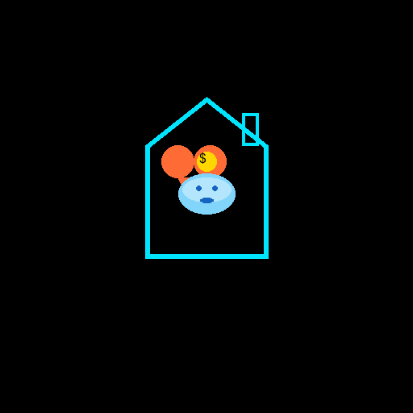

# 💰 FamBudget - Advanced Family Budget Management

<div align="center">



### **Take Control of Your Family's Finances**

[](https://github.com/lalupj07/FamBudget/releases)
[](LICENSE)
[](https://www.microsoft.com/store)
[](desktop-app/PRIVACY-POLICY.md)
[](https://github.com/lalupj07/FamBudget/releases)

[📥 Download](https://github.com/lalupj07/FamBudget/releases) • [📖 Documentation](#features) • [🐛 Report Bug](https://github.com/lalupj07/FamBudget/issues) • [💡 Request Feature](https://github.com/lalupj07/FamBudget/issues) • [📧 Contact](mailto:genxisinnovation@outlook.com)

---

</div>

## 🌟 Overview

**FamBudget** is a powerful, privacy-focused desktop application designed to help families manage their finances effectively. Built with modern web technologies and Electron, FamBudget offers an intuitive interface for tracking income, expenses, budgets, and financial goals—all while keeping your data **100% private** and secure on your local device.

### ✨ Why Choose FamBudget?

- 🔒 **Complete Privacy** - Your financial data never leaves your device
- 💰 **Multi-Currency** - Support for 10+ currencies worldwide
- 📊 **Beautiful Analytics** - Stunning charts and detailed reports
- 🎯 **Goal Tracking** - Set and achieve your savings goals
- 🌙 **Dark Mode** - Comfortable viewing day or night
- 🚀 **Offline First** - Works completely without internet
- ⚡ **Fast & Lightweight** - Quick startup, smooth performance
- 🎨 **Modern UI** - Clean, intuitive Material Design interface

---

## 🎯 Features

### 💵 **Income & Expense Management**

<table>
<tr>
<td width="50%">

**Multiple Income Sources**
- Track income from various sources
- Set up recurring income automatically
- Monitor income trends over time

**Smart Categorization**
- Custom expense categories
- Automatic categorization
- Category-based filtering

</td>
<td width="50%">

**Transaction History**
- Complete transaction timeline
- Advanced filtering options
- Search and sort capabilities
- Export to CSV

</td>
</tr>
</table>

### 📊 **Budgeting & Analytics**

<table>
<tr>
<td width="50%">

**Visual Budget Planner**
- Interactive budget sliders
- Real-time budget calculations
- Category-wise budget allocation

**Spending Analysis**
- Category breakdown charts
- Monthly spending trends
- Comparison reports

</td>
<td width="50%">

**Detailed Reports**
- Comprehensive financial reports
- Income vs Expense analysis
- Savings rate tracking
- Custom date ranges

</td>
</tr>
</table>

### 🎯 **Goal Management**

- **Savings Goals** - Set multiple savings targets
- **Progress Tracking** - Visual progress indicators
- **Deadline Management** - Track goal deadlines
- **Priority Levels** - Organize by importance
- **Contribution Tracking** - Monitor contributions over time

### 💱 **Multi-Currency Support**

Supported currencies include:
- 💵 **USD** - US Dollar
- 💶 **EUR** - Euro
- 💷 **GBP** - British Pound
- 💴 **JPY** - Japanese Yen
- 💴 **INR** - Indian Rupee
- 💵 **CAD** - Canadian Dollar
- 💵 **AUD** - Australian Dollar
- 💵 **CHF** - Swiss Franc
- 💴 **CNY** - Chinese Yuan
- 💵 **BRL** - Brazilian Real

### 🎨 **User Experience**

- **Dark Mode** 🌙 - Toggle between light and dark themes
- **Responsive Design** 📱 - Works on different screen sizes
- **Intuitive Navigation** 🧭 - Easy-to-use interface
- **Material Design** 🎨 - Modern, clean UI
- **Keyboard Shortcuts** ⌨️ - Power user features
- **Smooth Animations** ✨ - Polished user experience

### 🔒 **Privacy & Security**

<div align="center">

| Feature | Status |
|---------|--------|
| 🔐 Local Storage Only | ✅ Yes |
| 🌐 Data Transmission | ❌ None |
| 📊 User Tracking | ❌ None |
| 🔒 GDPR Compliant | ✅ Yes |
| 🛡️ CCPA Compliant | ✅ Yes |

</div>

---

## 📦 Installation

### 🪟 Windows Installation

#### **Option 1: NSIS Installer** (Recommended)
```bash
1. Download FamBudget-3.5.1-x64.exe from Releases
2. Run the installer
3. Follow the installation wizard
4. Launch from Start Menu
```

#### **Option 2: MSI Installer**
```bash
1. Download FamBudget-3.5.1-x64.msi from Releases
2. Double-click to install
3. Launch from Start Menu
```

#### **Option 3: Portable Version**
```bash
1. Download portable executable
2. Extract to any folder
3. Run FamBudget.exe (no installation needed)
```

### 📋 System Requirements

<div align="center">

| Requirement | Minimum |
|-------------|---------|
| **OS** | Windows 10 (1809+) |
| **Architecture** | x64 (64-bit) |
| **RAM** | 4 GB |
| **Storage** | 500 MB |
| **Display** | 1024x768 |

</div>

---

## 🚀 Quick Start Guide

### **Step 1: Launch the Application**
```
Open FamBudget from Start Menu or Desktop shortcut
```

### **Step 2: Add Your First Transaction**
```
1. Click "Add Transaction" button (top right)
2. Fill in description, amount, category, and date
3. Click "Save"
```

### **Step 3: Set Up Accounts**
```
1. Go to "Accounts" section
2. Add your bank accounts
3. Set initial balances
```

### **Step 4: Create Budget Goals**
```
1. Navigate to "Goals" section
2. Click "Add Goal"
3. Set target amount and deadline
```

### **Step 5: View Analytics**
```
1. Check "Dashboard" for overview
2. Visit "Reports" for detailed charts
3. Explore spending by category
```

---

## 📸 Screenshots

<div align="center">

### 📊 Dashboard View

*Comprehensive overview of your financial health*

### 💳 Transaction Management

*Easy transaction entry and management*

### 📈 Analytics & Reports

*Detailed charts and financial insights*

### 🎯 Goals Tracking

*Set and achieve your savings goals*

</div>

---

## 🏢 About GenXis Innovations

<div align="center">

### **Developing Innovative Software Solutions**


</div>

**FamBudget** is developed and maintained by **GenXis Innovations**, a technology company focused on creating innovative software solutions that prioritize user privacy and experience.

### 📋 Company Information

- **Company Name:** GenXis Innovations
- **Email:** genxisinnovation@outlook.com
- **Website:** https://github.com/lalupj07/GenXlink
- **License:** Apache License 2.0
- **Copyright:** © 2025 GenXis Innovations. All rights reserved.

### 🎯 Our Mission

To provide families with powerful, privacy-focused financial management tools that help them achieve their financial goals while maintaining **complete control** over their data.

### 🌟 Our Values

- 🔒 **Privacy First** - Your data stays yours
- 🎨 **User Experience** - Intuitive and beautiful design
- ⚡ **Performance** - Fast and efficient
- 🛡️ **Security** - Enterprise-grade security
- 🌍 **Accessibility** - Available to everyone

---

## 🛠️ Technology Stack

<div align="center">

| Category | Technology |
|----------|-----------|
| **Frontend** | HTML5, CSS3, JavaScript (ES6+) |
| **Framework** | Electron 27.3.11 |
| **Charts** | Chart.js 4.5.1 |
| **Icons** | Material Icons |
| **Build Tool** | Electron Builder |
| **Package Manager** | npm |

</div>

---

## 📋 Project Structure

```
FamBudget/
├── 📁 desktop-app/          # Desktop application
│   ├── 📄 app.js           # Main application logic
│   ├── 📄 main.js          # Electron main process
│   ├── 📄 index.html       # Main UI
│   ├── 📄 styles.css       # Styling
│   ├── 📄 api.js           # API service (optional)
│   └── 📁 assets/          # Images and icons
├── 📁 mobile/              # Mobile application (React Native)
├── 📁 backend/             # Backend API (NestJS)
├── 📄 CHANGELOG.md         # Version history
└── 📄 LICENSE              # Apache 2.0 License
```

---

## 🔄 Version History

See [CHANGELOG.md](CHANGELOG.md) for detailed version history.

### 🎉 Current Version: 4.0.0

**What's New:**
- ✅ GenXis Innovations branding
- ✅ Enhanced stability and error handling
- ✅ Fixed blank screen issues
- ✅ Microsoft Store ready
- ✅ Improved null checks throughout
- ✅ Comprehensive privacy policy
- ✅ Professional documentation

---

## 🤝 Contributing

We welcome contributions! Please feel free to submit a Pull Request.

### How to Contribute

1. 🍴 **Fork the repository**
2. 🌿 **Create your feature branch** (`git checkout -b feature/AmazingFeature`)
3. 💾 **Commit your changes** (`git commit -m 'Add some AmazingFeature'`)
4. 📤 **Push to the branch** (`git push origin feature/AmazingFeature`)
5. 🔀 **Open a Pull Request**

---

## 📝 License

This project is licensed under the **Apache License 2.0** - see the [LICENSE](LICENSE) file for details.

<div align="center">

[](https://opensource.org/licenses/Apache-2.0)

</div>

---

## 📧 Support & Contact

<div align="center">

| Contact Method | Details |
|----------------|---------|
| 📧 **Email** | genxisinnovation@outlook.com |
| 🐛 **Bug Reports** | [GitHub Issues](https://github.com/lalupj07/FamBudget/issues) |
| 💬 **Discussions** | [GitHub Discussions](https://github.com/lalupj07/FamBudget/discussions) |
| 📖 **Documentation** | [GitHub Wiki](https://github.com/lalupj07/FamBudget/wiki) |

</div>

---

## 🌐 Links & Resources

<div align="center">

[](https://github.com/lalupj07/FamBudget/releases)
[](https://github.com/lalupj07/FamBudget/issues)
[](desktop-app/PRIVACY-POLICY.md)
[](CHANGELOG.md)

</div>

---

## ⭐ Show Your Support

<div align="center">

### If you find FamBudget useful, please consider giving it a ⭐ on GitHub!

**Your support helps us improve FamBudget for everyone!**

[](https://github.com/lalupj07/FamBudget/stargazers)
[](https://github.com/lalupj07/FamBudget/network/members)
[](https://github.com/lalupj07/FamBudget/watchers)

</div>

---

<div align="center">

## 🎉 Made with ❤️ by [GenXis Innovations](https://github.com/lalupj07/GenXlink)

**Empowering families to take control of their finances**

---

[⬆ Back to Top](#-fambudget---advanced-family-budget-management)

</div>
