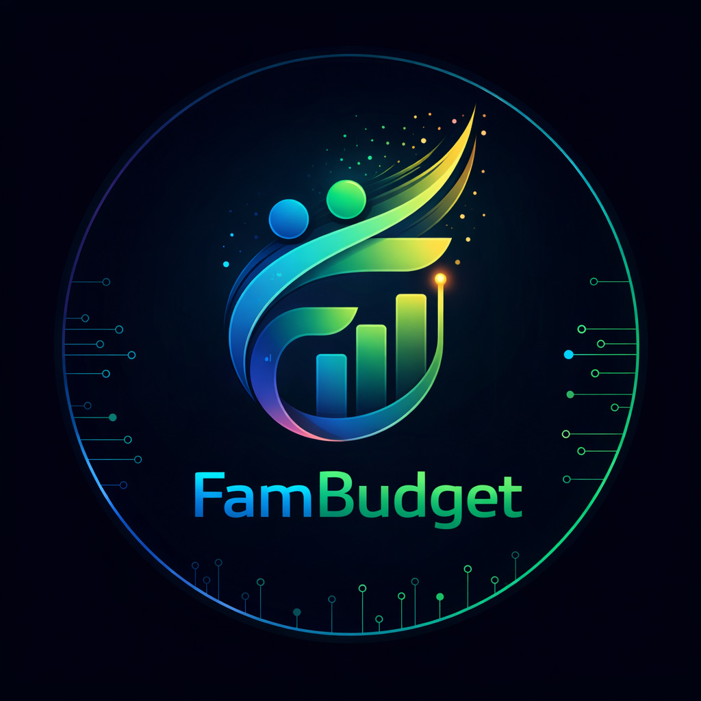
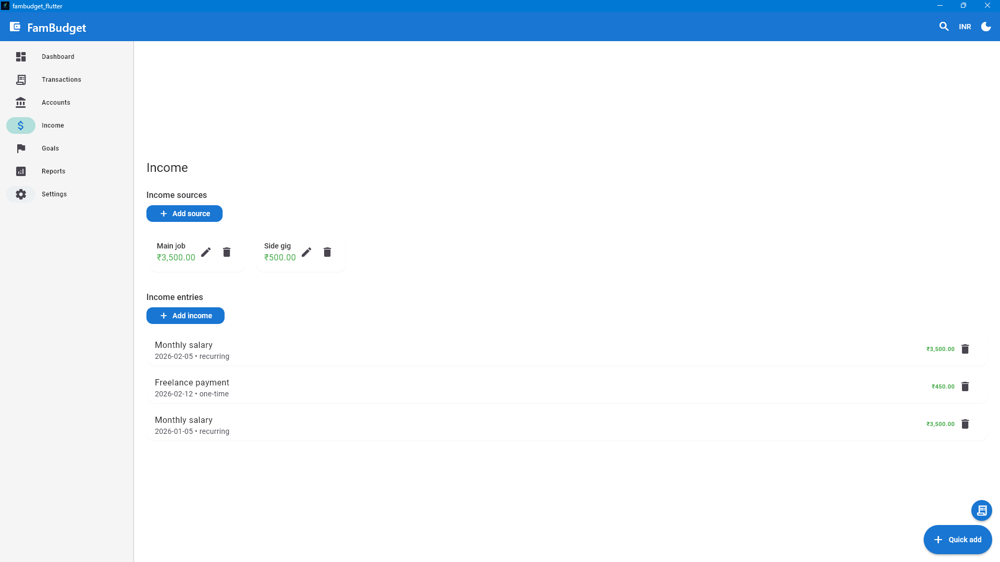
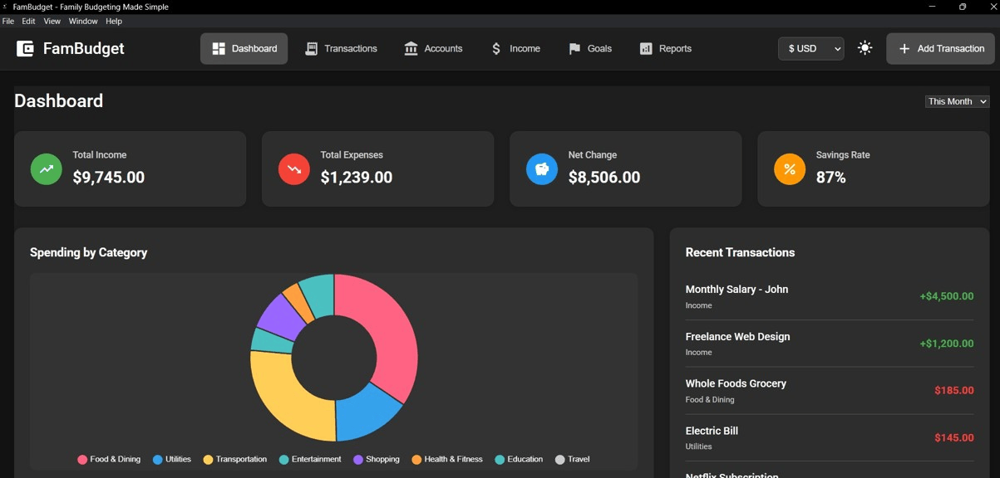
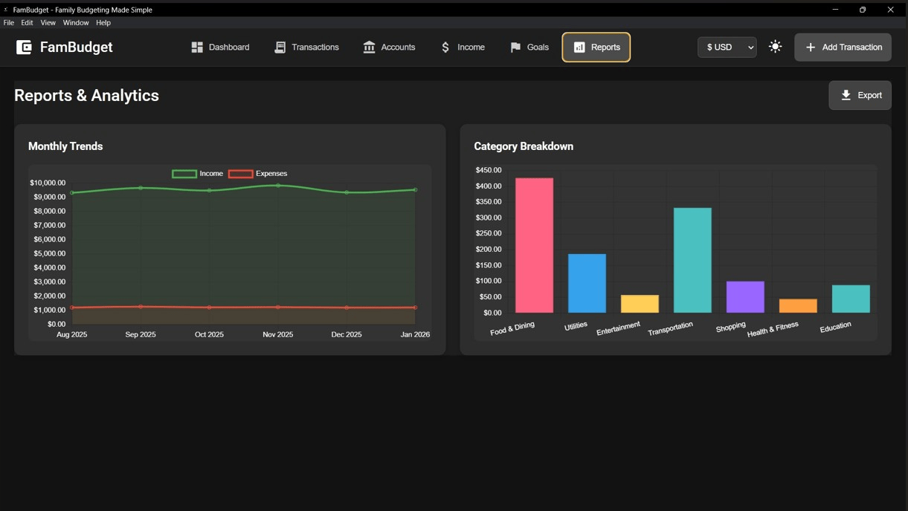
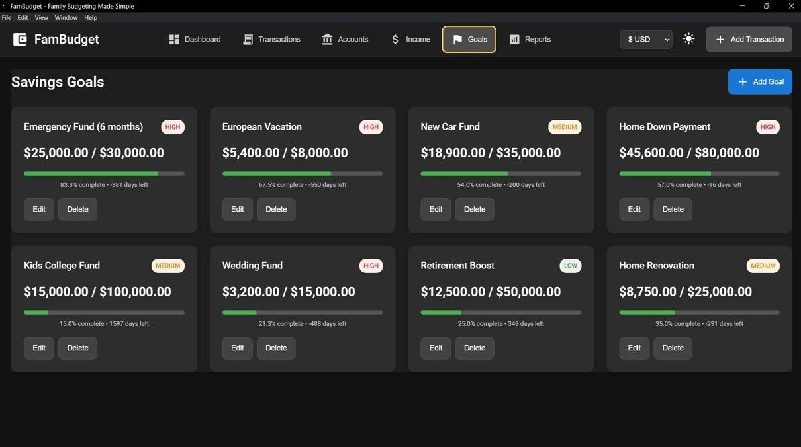
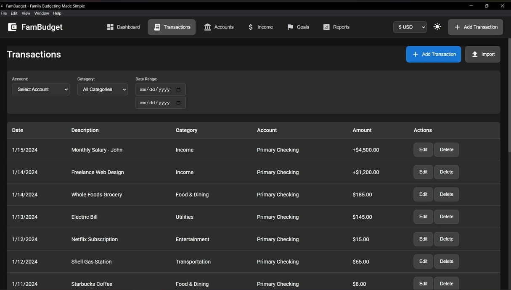
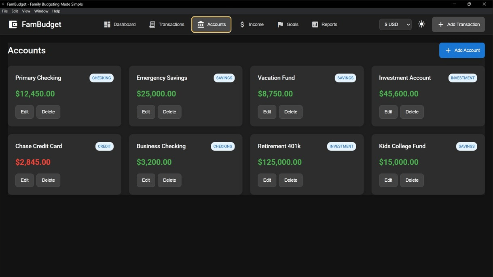

# 💰 FamBudget - Advanced Family Budget Management

<div align="center">



### **Take Control of Your Family's Finances**

[](https://github.com/lalupj07/FamBudget/releases)
[](LICENSE)
[](https://github.com/lalupj07/FamBudget/releases)
[](LICENSE)
[](https://flutter.dev)

[📥 Download](https://github.com/lalupj07/FamBudget/releases) • [📖 Documentation](#features) • [🐛 Report Bug](https://github.com/lalupj07/FamBudget/issues) • [💡 Request Feature](https://github.com/lalupj07/FamBudget/issues) • [📧 Contact](mailto:genxisinnovation@outlook.com)

---

</div>

## 🌟 Overview

**FamBudget** is a powerful, privacy-focused desktop application designed to help families manage their finances effectively. The **Windows desktop app** is built with **Flutter for Windows** (v5.0.0) and offers an intuitive interface for tracking income, expenses, budgets, and financial goals—all while keeping your data **100% private** and secure on your local device.

### ✨ Why Choose FamBudget?

- 🔒 **Complete Privacy** - Your financial data never leaves your device
- 💰 **Multi-Currency** - Support for 10+ currencies worldwide
- 📊 **Beautiful Analytics** - Stunning charts, spending trends, and detailed reports
- 🎯 **Goal Tracking** - Set goals with a built-in savings calculator
- 🔁 **Recurring Transactions** - Schedule and track recurring income and expenses
- 🌍 **12 Languages** - English, Spanish, French, Hindi, Malayalam, Arabic, Chinese, German, Portuguese, Tamil, Japanese, Telugu, Korean
- 🌙 **Dark Mode** - Comfortable viewing day or night
- 🚀 **Offline First** - Works completely without internet
- ⚡ **Fast & Lightweight** - Flutter Windows, quick startup, smooth performance
- 🎨 **Modern UI** - Clean, intuitive Material Design interface

---

## 🎯 Features

### 💵 **Income & Expense Management**

<div align="center">



</div>

<table>
<tr>
<td width="50%">

**Multiple Income Sources**
- Track income from various sources
- Set up recurring income automatically
- Monitor income trends over time
- Visual income source cards with progress tracking

**Smart Categorization**
- Custom expense categories
- Automatic categorization
- Category-based filtering
- Color-coded category system

</td>
<td width="50%">

**Transaction History**
- Complete transaction timeline
- Advanced filtering by account, category, and date range
- Search and sort capabilities
- Export to CSV
- Quick edit and delete actions

</td>
</tr>
</table>

### 📊 **Budgeting & Analytics**

<div align="center">


*Dashboard with key financial metrics and spending breakdown*


*Advanced analytics with monthly trends and category breakdown*

</div>

<table>
<tr>
<td width="50%">

**Visual Budget Planner**
- Interactive budget sliders
- Real-time budget calculations
- Category-wise budget allocation
- Spending by category donut chart

**Spending Analysis**
- Category breakdown bar charts
- Monthly spending trends line charts
- Comparison reports
- Visual progress indicators

</td>
<td width="50%">

**Detailed Reports**
- Comprehensive financial reports
- Income vs Expense analysis
- Savings rate tracking
- Custom date ranges
- Export functionality

</td>
</tr>
</table>

### 🎯 **Goal Management**

<div align="center">


*Track multiple savings goals with progress bars and priority levels*

</div>

- **Savings Goals** - Set multiple savings targets with target amounts
- **Progress Tracking** - Visual progress bars showing completion percentage
- **Deadline Management** - Track goal deadlines with countdown timers
- **Priority Levels** - Organize by HIGH, MEDIUM, or LOW priority
- **Contribution Tracking** - Monitor contributions over time
- **Goal Cards** - Beautiful card-based interface for easy goal management

### 💱 **Multi-Currency Support**

Supported currencies include:
- 💵 **USD** - US Dollar
- 💶 **EUR** - Euro
- 💷 **GBP** - British Pound
- 💴 **JPY** - Japanese Yen
- 💴 **INR** - Indian Rupee
- 💵 **CAD** - Canadian Dollar
- 💵 **AUD** - Australian Dollar
- 💵 **CHF** - Swiss Franc
- 💴 **CNY** - Chinese Yuan
- 💵 **BRL** - Brazilian Real

### 🎨 **User Experience**

- **Dark Mode** 🌙 - Toggle between light and dark themes
- **Responsive Design** 📱 - Works on different screen sizes
- **Intuitive Navigation** 🧭 - Easy-to-use interface
- **Material Design** 🎨 - Modern, clean UI
- **Keyboard Shortcuts** ⌨️ - Power user features
- **Smooth Animations** ✨ - Polished user experience

### 🔒 **Privacy & Security**

<div align="center">

| Feature | Status |
|---------|--------|
| 🔐 Local Storage Only | ✅ Yes |
| 🌐 Data Transmission | ❌ None |
| 📊 User Tracking | ❌ None |
| 🔒 GDPR Compliant | ✅ Yes |
| 🛡️ CCPA Compliant | ✅ Yes |

</div>

---

## 📦 Installation

### 🪟 Windows Installation (Flutter desktop v5.0.0)

#### **Option 1: Portable ZIP** (Recommended)
```bash
1. Download FamBudget-Portable-5.0.0.zip from Releases
2. Extract to any folder
3. Run fambudget_flutter.exe (no installation needed)
```

#### **Option 2: MSIX Installer**
```bash
1. Download FamBudget-Setup.msix from Releases
2. Double-click to install (Windows 10/11)
3. Launch from Start Menu
```

#### **Option 3: Setup.exe (Inno Setup)**
```bash
1. Download FamBudget-Setup-5.0.0.exe from Releases
2. Run the installer and follow the wizard
3. Launch from Start Menu
```

#### **Option 4: MSI Installer** (if provided)
```bash
1. Download FamBudget-Setup-5.0.0.msi from Releases
2. Double-click to install
3. Launch from Start Menu
```

**Building from source (Windows):**
```bash
cd fambudget_flutter
flutter pub get
flutter build windows --release
# Or run build_release.ps1 for portable ZIP + MSIX + installers:
# powershell -ExecutionPolicy Bypass -File .\build_release.ps1
```

### 📋 System Requirements

<div align="center">

| Requirement | Minimum |
|-------------|---------|
| **OS** | Windows 10 (1809+) |
| **Architecture** | x64 (64-bit) |
| **RAM** | 4 GB |
| **Storage** | 500 MB |
| **Display** | 1024x768 |

</div>

---

## 🚀 Quick Start Guide

<div align="center">


</div>

### **Step 1: Launch the Application**
```
Open FamBudget from Start Menu or Desktop shortcut
```

### **Step 2: Add Your First Transaction**
```
1. Click "+ Add Transaction" button (top right)
2. Fill in description, amount, category, and date
3. Click "Save"
```

<div align="center">



</div>

### **Step 3: Set Up Accounts**
```
1. Go to "Accounts" section
2. Click "+ Add Account" button
3. Add your bank accounts (Checking, Savings, Credit, Investment)
4. Set initial balances
```

<div align="center">



</div>

### **Step 4: Create Budget Goals**
```
1. Navigate to "Goals" section
2. Click "+ Add Goal" button
3. Set target amount, deadline, and priority level
4. Track your progress visually
```

<div align="center">


</div>

### **Step 5: View Analytics**
```
1. Check "Dashboard" for overview with key metrics
2. Visit "Reports" for detailed charts and trends
3. Explore spending by category
4. Monitor income vs expenses
```

<div align="center">


</div>

---

## 📸 Screenshots

<div align="center">

### 📊 Dashboard View

*Comprehensive overview of your financial health with key metrics, spending by category chart, and recent transactions*

### 💳 Transaction Management

*Easy transaction entry and management with advanced filtering options*

### 📈 Analytics & Reports

*Detailed charts and financial insights including monthly trends and category breakdown*

### 🎯 Savings Goals

*Set and achieve your savings goals with progress tracking and priority management*

### 💰 Accounts Overview

*Manage multiple accounts including checking, savings, credit cards, and investments*

### 💵 Income Tracker

*Track multiple income sources with expected vs actual income monitoring*

</div>

---

## 🏢 About GenXis Innovations

<div align="center">

### **Developing Innovative Software Solutions**


</div>

**FamBudget** is developed and maintained by **GenXis Innovations**, a technology company focused on creating innovative software solutions that prioritize user privacy and experience.

### 📋 Company Information

- **Company Name:** GenXis Innovations
- **Email:** genxisinnovation@outlook.com
- **Website:** www.genxisinnovation.in
- **License:** Apache License 2.0
- **Copyright:** © 2025 GenXis Innovations. All rights reserved.

### 🎯 Our Mission

To provide families with powerful, privacy-focused financial management tools that help them achieve their financial goals while maintaining **complete control** over their data.

### 🌟 Our Values

- 🔒 **Privacy First** - Your data stays yours
- 🎨 **User Experience** - Intuitive and beautiful design
- ⚡ **Performance** - Fast and efficient
- 🛡️ **Security** - Enterprise-grade security
- 🌍 **Accessibility** - Available to everyone

---

## 🛠️ Technology Stack

<div align="center">

| Category | Technology |
|----------|-----------|
| **Desktop (primary)** | Flutter for Windows |
| **Charts** | fl_chart |
| **Localization** | flutter_localizations (12 locales) |
| **Installers** | MSIX, Inno Setup, WiX MSI, Portable ZIP |
| **Legacy desktop** | Electron (desktop-app/) |
| **Mobile** | React Native / Expo |
| **Backend** | NestJS |

</div>

---

## 📋 Project Structure

```
FamBudget/
├── 📁 fambudget_flutter/   # Flutter Windows desktop app (primary, v5.0.0)
│   ├── 📄 lib/             # Dart source (screens, services, l10n)
│   ├── 📄 build_release.ps1 # Build portable ZIP, MSIX, Setup.exe, .msi
│   ├── 📁 installer/       # Inno Setup & WiX installer scripts
│   └── 📁 assets/          # App icon and resources
├── 📁 desktop-app/         # Legacy Electron desktop app
├── 📁 mobile/              # Mobile app (React Native / Expo)
├── 📁 backend/             # Backend API (NestJS)
├── 📁 screenshots/         # App screenshots for README
├── 📄 CHANGELOG.md         # Version history
└── 📄 LICENSE              # Apache 2.0 License
```

---

## 🔄 Version History

See [CHANGELOG.md](CHANGELOG.md) for detailed version history.

### 🎉 Current Version: 5.0.0

**What's New:**
- ✅ Flutter Windows desktop app as primary
- ✅ Category budgets, recurring transactions, quick-add, undo delete
- ✅ Goal calculator, spending trends, global search, duplicate hints
- ✅ Scheduled backup, profile photo, 12-language support
- ✅ Portable ZIP, MSIX, Inno Setup, and WiX MSI installers
- ✅ Apache 2.0 & GenXis Innovation licensing

---

## 🤝 Contributing

We welcome contributions! Please feel free to submit a Pull Request.

### How to Contribute

1. 🍴 **Fork the repository**
2. 🌿 **Create your feature branch** (`git checkout -b feature/AmazingFeature`)
3. 💾 **Commit your changes** (`git commit -m 'Add some AmazingFeature'`)
4. 📤 **Push to the branch** (`git push origin feature/AmazingFeature`)
5. 🔀 **Open a Pull Request**

---

## 📝 License

This project is licensed under the **Apache License 2.0** - see the [LICENSE](LICENSE) file for details.

<div align="center">

[](https://opensource.org/licenses/Apache-2.0)

</div>

---

## 📧 Support & Contact

<div align="center">

| Contact Method | Details |
|----------------|---------|
| 📧 **Email** | genxisinnovation@outlook.com |
| 🐛 **Bug Reports** | [GitHub Issues](https://github.com/lalupj07/FamBudget/issues) |
| 💬 **Discussions** | [GitHub Discussions](https://github.com/lalupj07/FamBudget/discussions) |
| 📖 **Documentation** | [GitHub Wiki](https://github.com/lalupj07/FamBudget/wiki) |

</div>

---

## 🌐 Links & Resources

<div align="center">

[](https://github.com/lalupj07/FamBudget/releases)
[](https://github.com/lalupj07/FamBudget/issues)
[](desktop-app/PRIVACY-POLICY.md)
[](CHANGELOG.md)

</div>

---

## ⭐ Show Your Support

<div align="center">

### If you find FamBudget useful, please consider giving it a ⭐ on GitHub!

**Your support helps us improve FamBudget for everyone!**

[](https://github.com/lalupj07/FamBudget/stargazers)
[](https://github.com/lalupj07/FamBudget/network/members)
[](https://github.com/lalupj07/FamBudget/watchers)

</div>

---

<div align="center">

## 🎉 Made with ❤️ by [GenXis Innovations](https://www.genxisinnovation.in)

**Empowering families to take control of their finances**

---

[⬆ Back to Top](#-fambudget---advanced-family-budget-management)

</div>
